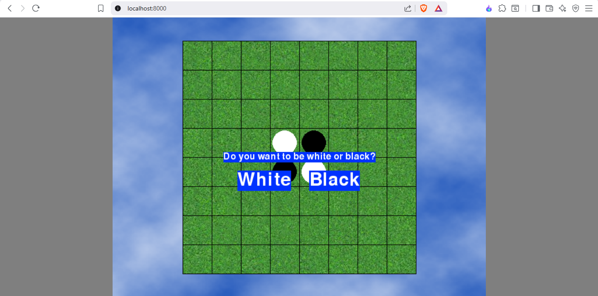

<div align="center">

# Flippy-Web


[](https://shivamkr12.github.io/Flippy-Web/)
[](https://github.com/ShivamKR12/Flippy-Web/actions/workflows/pygbag.yml)


</div>

**Flippy-Web** is a faithful implementation of the classic Reversi (also known as Othello) board game, developed in Python using the Pygame-CE library. Challenge yourself against a computer opponent featuring a simple AI strategy, and enjoy smooth gameplay with intuitive controls and visual feedback.

<div align="center">
  
</div>

## 🚀 Features

*   **Player Choice**: Select to play as either White or Black tiles, allowing for strategic flexibility.
*   **AI Opponent**: Face off against a computer player that employs random move selection for unpredictable gameplay.
*   **Hint System**: Enable visual hints to highlight all valid moves, perfect for beginners or strategic planning.
*   **Smooth Animations**: Enjoy fluid tile-flipping animations that bring the game to life.
*   **Real-Time Feedback**: Track scores and current turn with an on-screen display.
*   **Game Management**: Easily start a new game at any time to practice or replay.
*   **Play Online**: Experience the game directly in your web browser with no installation required.

## 🎮 Getting Started

You can easily play the game directly in your web browser without downloading anything!

1.  Go to the [**Play Online**](https://shivamkr12.github.io/Flippy-Web/) page.
2.  Wait a moment for it to load, and start playing!

## 🕹️ How to Play

*   **Mouse Click**: Place tiles on the board or interact with on-screen buttons.
*   **Hints Button**: Toggle the display of valid move highlights.
*   **New Game Button**: Reset the board and start a fresh game.
*   **Objective**: Have more tiles of your color than your opponent when the game ends. You capture opponent tiles by sandwiching them between your newly placed tile and another of your tiles.

## 📜 Game Rules

*   **Board Setup**: The game begins on an 8x8 board with four tiles placed in the center: two black and two white in a diagonal pattern.
*   **Turns**: Players alternate turns, starting with Black. On your turn, you must place a tile that captures at least one of your opponent's tiles.
*   **Capturing Tiles**: A move is valid if it sandwiches one or more opponent tiles between your new tile and another of your tiles (horizontally, vertically, or diagonally). All sandwiched tiles flip to your color.
*   **Passing**: If a player has no valid moves, they must pass their turn. The game continues until both players pass consecutively.
*   **Winning**: The player with the most tiles of their color at the end wins.

## 🛠️ Building From Source

If you want to build the game yourself, you'll need Python 3.6 or higher and some dependencies.

1.  **Clone the repository:**
    ```sh
    git clone https://github.com/ShivamKR12/Flippy-Web.git
    cd Flippy-Web
    ```

2.  **Create a virtual environment (recommended):**
    ```sh
    python -m venv venv
    source venv/bin/activate  # On Windows, use `venv\Scripts\activate`
    ```

3.  **Install dependencies:**
    ```sh
    pip install pygame-ce pygbag
    ```

4.  **Launch the Game:**
    ```sh
    pygbag main.py
    ```
    This will open the game in your default web browser on a local server.

## 👏 Credits

*   **Game Logic**: Based on the classic Reversi/Othello rules.
*   **Framework**: Built using [Pygame-CE](https://pygame-community.github.io/pygame-ce/).
*   **Development**: Created by ShivamKR12.

## 📄 License

This project is licensed under the MIT License. See the [LICENSE](LICENSE) file for details.
